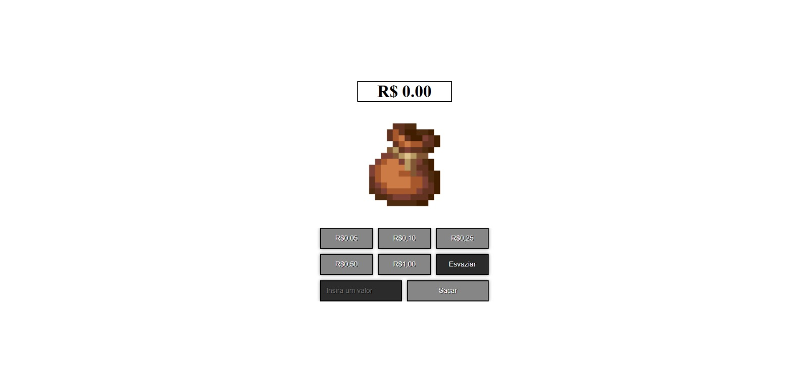
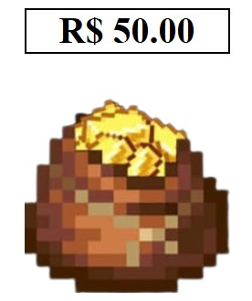

# 💰 Projeto 2: Cofrinho Digital – Simulador de Economia

## 📝 Descrição

Este projeto consiste em um simulador de cofre digital que permite adicionar moedas fictícias e acompanhar o total acumulado. Desenvolvido com HTML, CSS e JavaScript puros, o sistema apresenta funcionalidades como adição de valores monetários, saque condicionado ao saldo, esvaziamento do cofre e exibição formatada do total. Ideal para introduzir conceitos de manipulação do DOM, controle de eventos, uso de `localStorage` e operações aritméticas com valores formatados.

---

## 📸 Imagens

### Tela Inicial



### Cofre com Moedas



---

## ⚙️ Funcionalidades

* [x] Botões para adicionar moedas de **R\$0,10**, **R\$0,25**, **R\$0,50** e **R\$1,00**
* [x] Total atualizado **em tempo real**
* [x] Botão **Sacar** com verificação de saldo e alerta em caso de saldo insuficiente
* [x] Botão **Esvaziar Cofre**
* [x] Total exibido com **formatação monetária** (`toFixed(2)` ou `Intl.NumberFormat`)
* [x] **Sem uso de frameworks** (apenas HTML, CSS e JS puros)

---

## ✨ Melhorias Implementadas (opcionais)

* [] Contador de moedas por tipo (quantas de R\$0,10, R\$0,25, etc.)
* [] Armazenamento do total no `localStorage` (valor persiste após recarregar a página)
* [x] Imagem que **enche visualmente** conforme as moedas são adicionadas

---

## 🔧 Como modificar a moeda usada

Para alterar a moeda de **R\$ (Real)** para **US\$ (Dólar)**:

1. Atualize os valores exibidos nos botões e na exibição do total.
2. Modifique o uso do `Intl.NumberFormat` para o formato americano:

```javascript
const formatter = new Intl.NumberFormat('en-US', {
  style: 'currency',
  currency: 'USD'
});
```

---

## 📊 Sugestão de Versão com Gráficos (nível intermediário)

Como melhoria opcional, é possível integrar uma biblioteca como o **Chart.js** para mostrar graficamente:

* Distribuição das moedas por valor
* Evolução do saldo ao longo do tempo
* Progresso visual do cofre com gráficos circulares ou de barras

---

## 📚 Explicação da Lógica

A lógica do projeto gira em torno da manipulação de um valor acumulado representando o saldo do cofre. Cada clique em um botão de moeda adiciona seu valor ao total. A função `atualizarTotal()` é responsável por exibir o novo saldo no formato correto. O botão de saque verifica se há saldo suficiente antes de subtrair o valor informado. O uso de `localStorage` permite persistir o estado do cofre entre sessões.

---

## 🛠️ Tecnologias Utilizadas

* HTML5
* CSS3
* JavaScript

---

## 📁 Estrutura de Arquivos

```
projeto-cofrinho-digitalqe/
│
├── index.html
├── style.css
├── script.js
└── img/
    ├── trouxa1.png
    ├── trouxa2.png
    ├── trouxa3.png
    └── trouxa4.png
```
